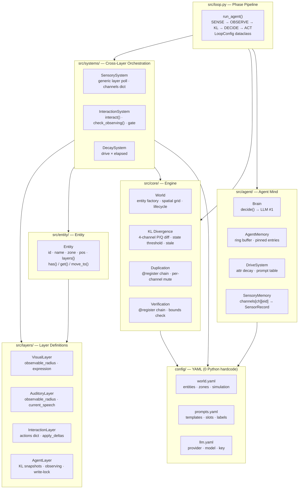
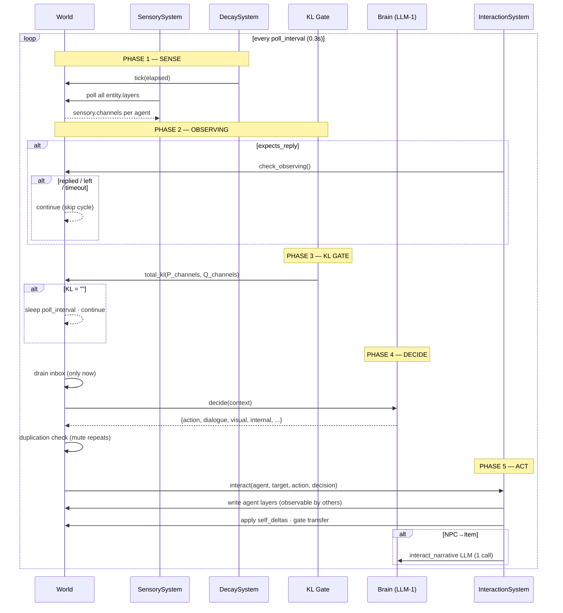
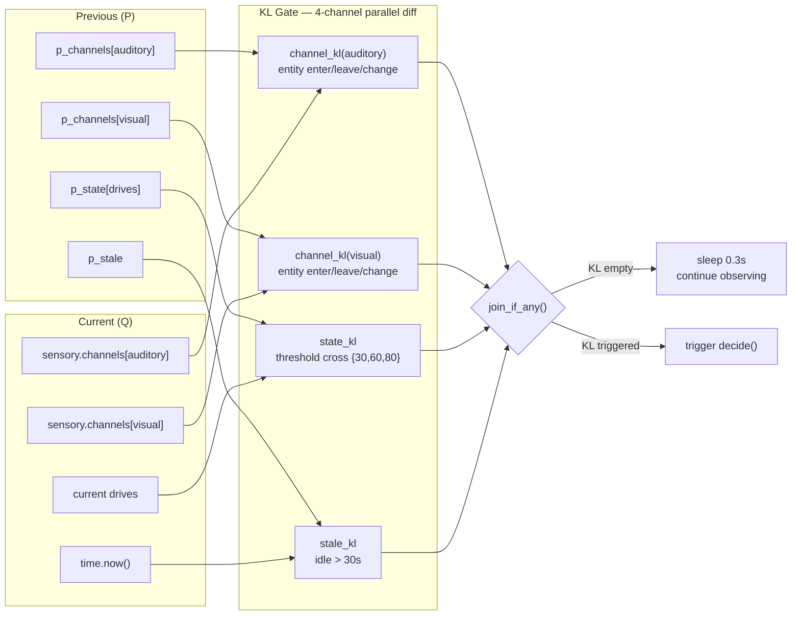
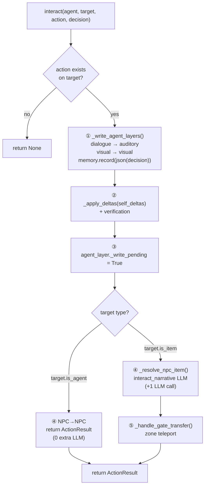

<p align="center">
  
  
  
  
  
</p>

<h1 align="center">
  AgentWorld Async<br/>
  <sub>异步多智能体自主世界引擎</sub>
</h1>

<p align="center">
  <b>P/Q/KL-Driven · Layer-Architected · Phase-Pipelined · LLM-Powered</b><br/>
  <b>P/Q/KL 驱动 · 分层架构 · 相位流水线 · LLM 赋能</b>
</p>

<p align="center">
  <i>"The world doesn't change — the agent doesn't think."</i><br/>
  <i>"世界不变化，Agent 不思考。"</i>
</p>

---

## Architecture



---

## Agent Loop — Phase Pipeline



---

## P/Q/KL Attention Gate



---

## Layer Architecture

```mermaid
classDiagram
    class Layer {
        <<abstract>>
        +observable_radius
        +properties dict
        +observe(d) dict
    }

    class VisualLayer {
        +visible_radius
        +sprite
        +sprite_sheet
        +observe(d) → {look, detail, expression}
    }

    class AuditoryLayer {
        +audible_radius
        +current_speech
        +speech_ts
        +observe(d) → {sound, volume, current_speech}
    }

    class InteractionLayer {
        +interaction_radius
        +public_attrs dict
        +private_attrs dict
        +actions dict
        +apply_deltas(d) dict
    }

    class AgentLayer {
        +autonomous · speed · radii
        +drives · sensory · memory · inbox
        +p_channels · p_state · p_stale
        +_write_pending
        +expects_reply · observing_target
    }

    class Entity {
        +id · name · zone · pos
        +layers dict
        +describe
        +has(layer) · get(layer)
        +move_to() · distance_to()
    }

    Layer <|-- VisualLayer
    Layer <|-- AuditoryLayer
    Layer <|-- InteractionLayer
    Layer <|-- AgentLayer
    Entity o-- Layer : layers{}

    class SensorySystem {
        +update(observer, entities)
        iterate entity.layers → call observe(d)
    }

    SensorySystem --> Layer : polls
```

---

## `interact()` — Unified Entry



---

## Comparison

| | Generative Agents<br/><sub>Park et al. 2023</sub> | CrewAI / AutoGen | **AgentWorld Async** |
|---|---|---|---|
| **Decision trigger** | Fixed-interval reflection | Tool-calling pipeline | **P/Q/KL attention gate** — event-driven |
| **LLM calls / interaction** | 3+ (plan + reflect + act) | 1 per tool call | **1** (NPC→NPC) · **2** (NPC→Item) |
| **Agent-to-agent** | One-way observation | Message-passing | **Mutual observation** — A writes blackboard, B polls |
| **Personality** | Prompt only | Prompt only | **LLM #1 output drives behavior** — no proxy projection |
| **Config** | Code + JSON | Python decorators | **Pure YAML** — zero code changes to switch worlds |
| **Memory** | Reflection-based summary | Chat history | **Full decision JSON** — all modalities retained |
| **Architecture** | Monolithic agent loop | Distributed agents | **Layer-based** — Entity/AgenLayer separation |
| **State ownership** | Entity stores all | Agent stores all | **AgentLayer** only — Entity is universal container |

---

## Key Innovations

| # | Innovation | Why It Matters |
|---|-----------|----------------|
| 1 | **P/Q/KL Attention Gate** | 4-channel parallel diff (auditory/visual/state/temporal). Agent only calls LLM when world actually changes. Not a timer. |
| 2 | **Phase Pipeline** | SENSE → OBSERVING → KL GATE → DECIDE → ACT. Each phase can `continue` independently. Readable control flow. |
| 3 | **Unified `interact()`** | NPC→NPC and NPC→Item share one code path. B answers via own `decide()` — no proxy projection engine. |
| 4 | **Layer Architecture** | Visual/Auditory/Interaction layers. `observe(d)` is the sole interface. Sensory polls generically. New modal = YAML only. |
| 5 | **AgentLayer State Isolation** | All agent-specific state (KL snapshots, observing, write-lock, duplication) lives on AgentLayer. Entity is pure: id/name/zone/pos/layers. |
| 6 | **Config-as-Behavior** | All text, thresholds, currency keys from YAML. Swap `world.yaml` = new world. Zero Python changes. |
| 7 | **Full Decision Memory** | Entire LLM #1 output (dialogue, visual, internal, self_deltas, story, expects_reply, patience) recorded as JSON. |
| 8 | **Generic Layer Observation** | All layers inherit `observe(d)` + `observable_radius`. Sensory polls all layers generically. No hardcoded channel names. |
| 9 | **Typed LoopConfig** | Dataclass replaces raw dict — type-safe, IDE-completable, self-documenting. No more `cfg.get("what_was_that_key")`. |
| 10 | **Duplication Check** | `@register` validator chain. Per-channel mute mask from YAML. Sliding reference — only advances on genuinely new output. |

---

## Project Structure

```
AgentWorld_Async/                  # 36 source files · ~2300 lines
├── config/
│   ├── world.yaml                 # 3 zones, 28 entities, simulation params
│   ├── prompts.yaml               # system_prompts, templates, slots, labels, duplication
│   └── llm.yaml                   # provider (OpenAI/DeepSeek/MiniMax), model, key
├── src/
│   ├── layers/                    # Layer definitions (4 files)
│   │   ├── base.py                #   Layer base: observable_radius, observe(d)
│   │   ├── visual.py              #   VisualLayer: visible_radius, expression
│   │   ├── auditory.py            #   AuditoryLayer: audible_radius, current_speech
│   │   ├── interaction.py         #   InteractionLayer: actions dict, apply_deltas
│   │   └── agent.py               #   AgentLayer: KL snapshots, observing, write-lock
│   ├── entity/                    # Entity model (2 files)
│   │   ├── entity.py              #   Entity: id, name, zone, pos, layers{}, has/get
│   │   └── event_entity.py        #   EventEntity: spawned_at, lifespan, auto-expiry
│   ├── systems/                   # Cross-layer orchestration (3 files)
│   │   ├── sensory.py             #   Generic layer poll → sensory.channels
│   │   ├── interaction.py         #   interact() + check_observing() + find_entity_at
│   │   └── decay.py               #   DriveSystem.tick(elapsed)
│   ├── agent/                     # Agent mind (5 files)
│   │   ├── brain.py               #   decide() + extract_json()
│   │   ├── drives.py              #   DriveSystem: attrs dict, decay rates, prompt table
│   │   ├── memory.py              #   AgentMemory: ring buffer, pinned entries
│   │   ├── sensory_memory.py      #   SensoryMemory: channels[ch][eid] → SensorRecord
│   │   └── inbox.py               #   Inbox: send/drain/to_prompt_text
│   ├── core/                      # Engine core (7 files)
│   │   ├── world.py               #   World container, entity factory, spatial grid
│   │   ├── kl_divergence.py       #   4-channel P/Q KL diff, state threshold, stale
│   │   ├── duplication.py         #   @register chain, per-channel mute
│   │   ├── verification.py        #   @register chain, attribute bounds check
│   │   ├── persistence.py         #   SQLite WorldDB (runs, snapshots, interactions)
│   │   ├── lifecycle.py           #   EntityLifecycle: spawn/despawn/transfer
│   │   ├── spatial_grid.py        #   O(k) cell-based proximity queries
│   │   └── clock.py               #   Simulated clock, configurable timescale
│   ├── llm/                       # LLM client (1 file)
│   │   └── client.py              #   OpenAI/DeepSeek/MiniMax, retry, response_format
│   ├── prompt/                    # Prompt assembly (2 files)
│   │   ├── assembler.py           #   Slot assembly: content/runtime/topology providers
│   │   └── loader.py              #   YAML config reader
│   └── loop.py                    #   Phase pipeline + LoopConfig dataclass
├── main.py                        # CLI entry: --test, --demo, --persist, --validate
├── requirements.txt
└── README.md
```

---

## Quick Start

```bash
pip install -r requirements.txt
# Edit config/llm.yaml with your API key
python main.py                              # 8-agent concurrent test (default 60s)
python main.py --runtime 180 --validate     # 3min + attribute validation
python main.py --demo                       # Single-agent demo
python main.py --persist world.db           # Enable SQLite persistence
python main.py --output trace.json          # Save trace data
```

---

## Update Log

| Version | Milestone |
|---------|-----------|
| **v5.1** | Phase pipeline (SENSE→OBSERVING→KL→DECIDE→ACT). AgentLayer state isolation — all 11 agent-specific fields removed from Entity. Typed LoopConfig dataclass. Inbox drain timing fix. InteractionSystem method extraction (_write_agent_layers, _resolve_npc_item, _handle_gate_transfer). |
| **v5** | Generic Layer.observe() + observable_radius. Sensory polls all layers. channel_kl full dict diff. Property verification (@register). SQLite persistence (--persist). Dead code elimination (-24000 lines). |
| **v4** | P/Q/KL gate + observing baseline + write-pending lock. Unified interact(). Config decoupling. Full memory retention. |
| v3 | Story-first pipeline + per-agent projection + verify |
| v2 | Multi-agent async: inbox messaging, hybrid busy-queue |
| v1 | Single-agent demo with graph-based world model |

---

## License

MIT
