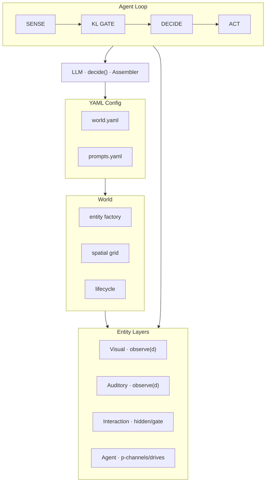
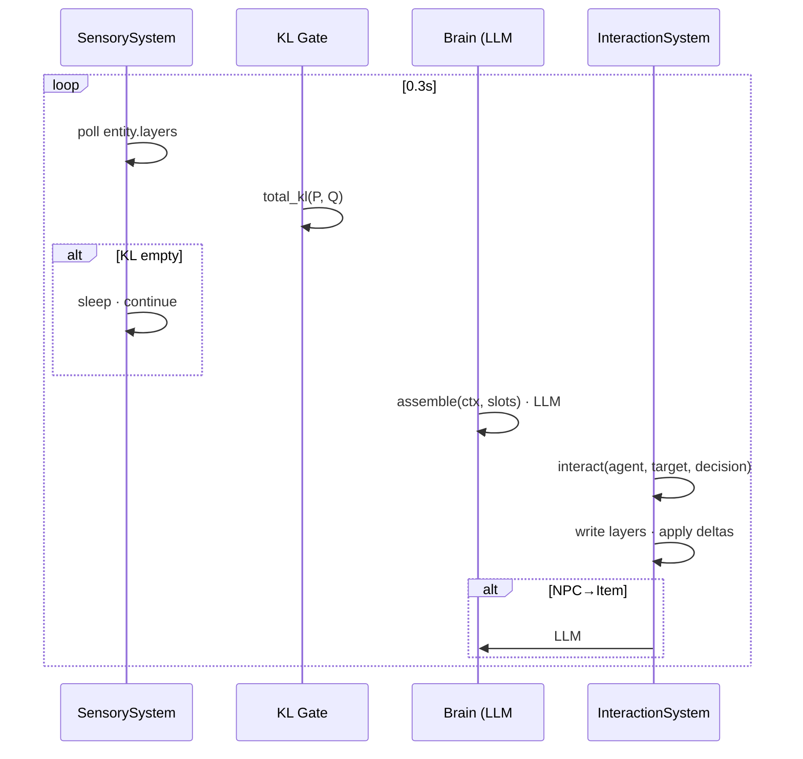
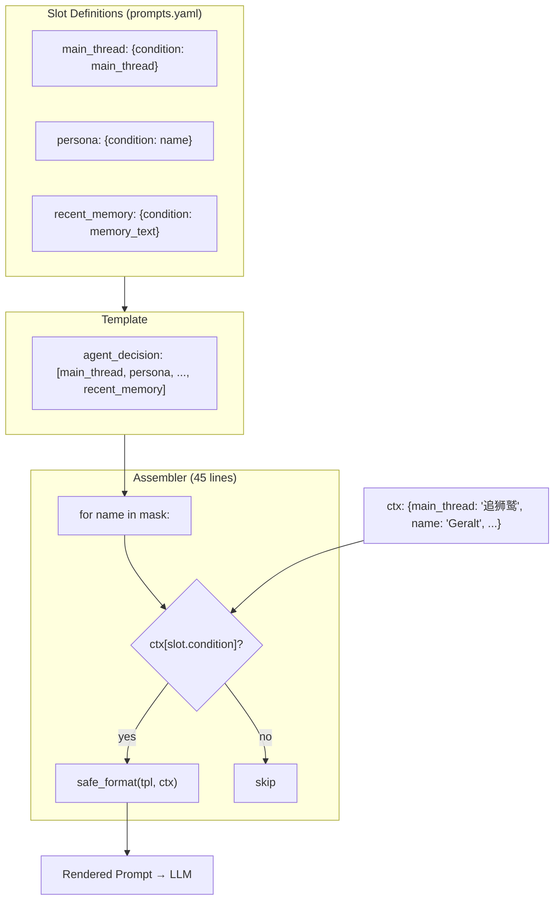

<p align="center">
  
  
  
  
  
</p>

<h1 align="center">AgentWorld Async</h1>

<p align="center">
  <b>Between perception and action, code does one thing: compare world model to sensory input.<br/>
  Everything else — what matters, what to do, what not to repeat — is declaration, not code.</b>
</p>

<p align="center">
  <i>The world doesn't change — the agent doesn't think.</i>
</p>

---

# 中文版

## 概述

一个纯 Python 异步多智能体自主世界引擎。最多 25 个 LLM 驱动 Agent，最多 7 个 Zone，全 YAML 配置驱动，Python 零领域知识硬编码。33 个源文件，~1800 行 Python，~820 行 YAML。

### 核心主旨

> **引擎提供世界，LLM 提供认知。**
>
> 引擎不替 LLM 做判断。引擎说"你周围有 3 个人"——不说"你应该跟谁说话"。
> 引擎说"世界变了"——不说"这个变化重要"。
> 引擎说"你上次做了 X"——不说"你不应该再做 X"。
>
> 全部认知判断通过 **12 个声明式 YAML slot** 引导 LLM 完成。
> 新增认知能力 = 加一个 slot 定义 + 模板列表加一行。**零认知代码。**
>
> 📄 完整设计哲学：[DESIGN_PHILOSOPHY.md](DESIGN_PHILOSOPHY.md)（Agent 特有） · [META_PHILOSOPHY.md](META_PHILOSOPHY.md)（跨域抽象）

---

## 核心创新

### 预测误差驱动，非定时器驱动

斯坦福 2023《Generative Agents》(GA) 按固定时间间隔反思→规划→行动，每 NPC 交互调用 3+ 次 LLM。AgentWorld 的核心发现：**Agent 不需要定时思考，只需在内部世界模型与感官输入不符时才行动。**

实现：P/Q/KL 注意力门控。Agent 维护 P（上次感官快照），每 0.3s 对比 Q（当前感官）。P=Q → 0 次 LLM 调用。P≠Q → 触发决策。四通道（听觉/视觉/状态/时差）并行 diff。

### 声明式 Slot 向量替代硬编码认知堆栈

GA 的认知机制（记忆检索、反思、计划、重要度评估）约 730 行 Python 实现。AgentWorld 用 12 个 YAML slot 替代全部认知代码：45 行的 Assembler 遍历模板的 slot 列表，检查 condition，渲染 template。新增 slot = YAML 两行，Python 零改动。

### 删除胜过添加

v1→v7 的进化方向是持续删除"代码替 LLM 做判断"的机制：graph resolver → submit chain → event bus → action registry → observing state machine → duplication filter → sensory hardcode → inbox。每删除一个调度器，LLM 多拿回一块决策权。

### 三通道模板驱动感官

视觉(远观+细节)·听觉(谁说了话)·可交互(hidden/gate)。三个通道的渲染模板全在 YAML 定义。新增通道 = YAML 加一条 `sensory_prompts` 条目。

---

## 实证数据

**180s 测试（25 Agent，3 Zone，DeepSeek-chat）：**

| 指标 | 数值 |
|------|------|
| 总行动 | **1196**（6.6/s） |
| NPC↔NPC 交互 | **1067**（89%） |
| 邻接重复率 | **0.7%**（LLM 记忆自调节，无外部去重） |
| 通道变化检测 | **1157** 次（0 误触发，P/Q dict copy fix） |
| 感官通道 | 视觉 · 听觉 · 可交互（YAML 模板驱动） |
| 输出模态 | 对话 + 故事 + 表情 + 内心（全覆盖） |

**60s 快速测试**：191 行动，3.6% 邻接重复，0 intent 盲执行。

**涌现的社交结构**：三个独立社交群——酒馆（猎魔人帮 + 情报线）、村庄（鞋匠摊情报网 + 狮鹫追踪队）、营地（炼金协作 + 军需暗线）。

### 与同类工作的量化对比

| | Generative Agents<br/>Park et al. 2023 | CrewAI | **AgentWorld Async** |
|---|---|---|---|
| LLM 调用 / NPC 交互 | **3+**（plan+reflect+act） | 1 per tool | **1** |
| 发呆时 LLM 调用 | 有（定时反思） | 无 | **0**（KL 门） |
| Agent 间通信 | 单向观察 | 消息传递 | **相互观察**（写层→轮询） |
| 认知代码量 | ~730 行 Python | N/A | **0 行**（12 YAML slot） |
| 动作定义 | 自然语言计划 | 工具函数注册 | **自然语言**，无注册表 |
| 记忆 | 反思摘要 | 对话历史 | **自然语言 story** |
| 配置 | Code + JSON | Python 装饰器 | **纯 YAML** |
| 规模 | 25 agent, 2 天 | 不等 | **25 agent, 33 文件, ~1800 行** |

---

## 架构



### 4 相位流水线



### Slot 向量：认知即组合



---

## 项目结构

```
AgentWorld_Async/               # 33 files · ~1800 lines Python · ~820 lines YAML
├── config/
│   ├── world.yaml              # 3-7 zones, 25-71 entities
│   ├── prompts.yaml            # system prompts, templates, 12 slots, sensory_prompts
│   └── llm.yaml                # provider (DeepSeek/OpenAI/MiniMax)
├── src/
│   ├── layers/                 # Layer definitions (5 files)
│   ├── entity/                 # Entity model (1 file)
│   ├── systems/                # Sensory, Interaction, Decay (3 files)
│   ├── agent/                  # Brain, Memory, Drives, SensoryMemory (4 files)
│   ├── core/                   # World, KL, Verification, Persistence, Lifecycle, SpatialGrid, Clock (7 files)
│   ├── llm/                    # LLM client (1 file)
│   ├── prompt/                 # Assembler, Loader (2 files)
│   └── loop.py                 # 4-phase pipeline
├── main.py                     # CLI entry
├── DESIGN_PHILOSOPHY.md        # AgentWorld-specific design philosophy
├── META_PHILOSOPHY.md          # Cross-domain meta principles
└── README.md
```

---

## 快速开始

```bash
pip install -r requirements.txt
# 编辑 config/llm.yaml 填入 API Key
python main.py                              # 25-agent 并发测试 (60s)
python main.py --runtime 180 --validate     # 3min + 属性校验
python main.py --demo                       # 单 Agent 演示
python main.py --output trace.json          # 保存追踪数据
```

## 版本记录

| 版本 | 里程碑 |
|------|--------|
| **v7.1** | `main_thread` slot（LLM 自维护持久目标）；`idle_guidance`（教 LLM 输出 null）；Intent DONE 前缀消除盲执行；inbox 删除 |
| **v7** | 三通道感官系统（visual/auditory/interaction）；YAML 模板驱动渲染；P/Q dict copy fix |
| **v6** | Slot 向量系统（condition=ctx key）；删除 duplication + observing state machine；-364 行死代码 |
| v5.2 | 删除 action registry；交互层 hidden + gate；KL 文本注入 |
| v5 | 泛型 Layer.observe()；属性校验；SQLite 持久化 |
| v4 | P/Q/KL 门控 + 写锁；统一 interact() |

---

## 许可证

MIT

---

# English

## Overview

A pure-Python asynchronous multi-agent autonomous world engine. Up to 25 LLM-driven agents across up to 7 zones. Fully YAML-configured; Python contains zero hardcoded domain knowledge. 33 source files, ~1800 lines of Python, ~820 lines of YAML.

### Core Thesis

> **The engine provides the world. The LLM provides cognition.**
>
> The engine never makes semantic decisions. It says "3 people are nearby" — not "you should talk to them."
> It says "the world changed" — not "this change matters."
> It says "you did X last time" — not "you shouldn't do X again."
>
> All cognitive judgments are guided by **12 declarative YAML slots.**
> New cognitive capability = one slot definition + one name in a template list. **Zero cognitive code.**
>
> 📄 Full philosophy: [DESIGN_PHILOSOPHY.md](DESIGN_PHILOSOPHY.md) (AgentWorld-specific) · [META_PHILOSOPHY.md](META_PHILOSOPHY.md) (cross-domain)

---

## Key Contributions

### Prediction Error, Not Timers

Stanford 2023 *Generative Agents* (GA) reflects on a fixed interval, requiring 3+ LLM calls per NPC interaction. We find: **an agent doesn't need to think on a schedule — only when its internal world model diverges from sensory input.**

Implementation: **P/Q/KL Attention Gate.** The agent maintains P (last sensory snapshot), compares Q (current input) every 0.3s. P=Q → **zero LLM calls.** P≠Q → agent decides. Four channels (auditory/visual/state/temporal) diff in parallel.

### Declarative Slot Vectors Replace Hardcoded Cognitive Stacks

GA's cognitive mechanisms (memory retrieval, reflection, planning, importance scoring) require ~730 lines of Python. AgentWorld replaces all of them with 12 YAML slots: a 45-line Assembler iterates a template's slot list, checks conditions, renders templates. New slot = two YAML entries. Zero Python changes.

### Removal Over Addition

v1→v7 evolves by continuously *removing* mechanisms that "code makes decisions on behalf of the LLM": graph resolver → submit chain → event bus → action registry → observing state machine → duplication filter → sensory hardcode → inbox. Each removal restores one piece of decision-making autonomy to the LLM.

### Three-Channel Template-Driven Sensory

Visual (look+detail) · Auditory (speech) · Interaction (hidden/gate). Rendering templates for all three channels defined in YAML. New sensory channel = one `sensory_prompts` entry.

---

## Empirical Results

**180s test (25 agents, 3 zones, DeepSeek-chat):**

| Metric | Value |
|--------|-------|
| Total Actions | **1196** (6.6/s) |
| NPC↔NPC Interactions | **1067** (89%) |
| Adjacent Repeat Rate | **0.7%** (LLM memory self-regulation) |
| Channel Changes Detected | **1157** (0 false triggers) |
| Sensory Channels | Visual · Auditory · Interaction (YAML template-driven) |
| Output Modalities | Dialogue + Story + Visual + Internal (full coverage) |

**60s test**: 191 actions, 3.6% adj dupes, 0 blind intent executions.

**Emergent social structure**: three independent clusters — Tavern (witchers + intelligence), Village (shoe-stall spy ring + gryphon hunting party), Garrison (alchemy + supply).

### Quantitative Comparison

| | Generative Agents<br/>Park et al. 2023 | CrewAI | **AgentWorld Async** |
|---|---|---|---|
| LLM calls / NPC interaction | **3+** (plan+reflect+act) | 1 per tool | **1** |
| LLM calls while idle | Yes (scheduled) | No | **0** (KL gate) |
| Agent communication | One-way observation | Message-passing | **Mutual observation** (layer write → poll) |
| Cognitive code | ~730 lines Python | N/A | **0 lines** (12 YAML slots) |
| Action definition | NL plans | Tool functions | **Natural language**, no registry |
| Memory | Reflection summary | Chat history | **Natural language story** |
| Config | Code + JSON | Python decorators | **Pure YAML** |
| Scale | 25 agents, 2 days | Varies | **25 agents, 33 files, ~1800 lines** |

---

## Architecture, Project Structure, Quick Start

*Same as Chinese section above.*

---

## Update Log

| Version | Milestone |
|---------|-----------|
| **v7.1** | `main_thread` slot (LLM-maintained persistent goal); `idle_guidance` (null-as-default); Intent DONE prefix; inbox deletion |
| **v7** | Three-channel sensory (visual/auditory/interaction); YAML template-driven rendering; P/Q dict copy fix |
| **v6** | Slot vector system (condition=ctx key); removed dedup + observing state machine; -364 lines dead code |
| v5.2 | Action registry eliminated; hidden + gate on interaction layer; KL text injection |
| v5 | Generic Layer.observe(); property verification; SQLite persistence |
| v4 | P/Q/KL gate + write-pending lock; unified interact() |

---

## License

MIT
