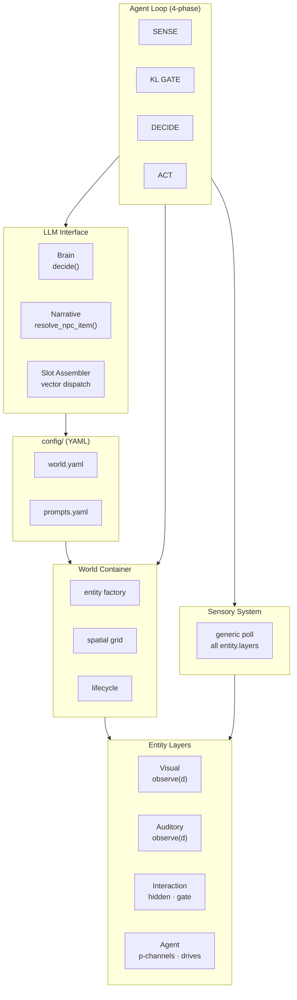
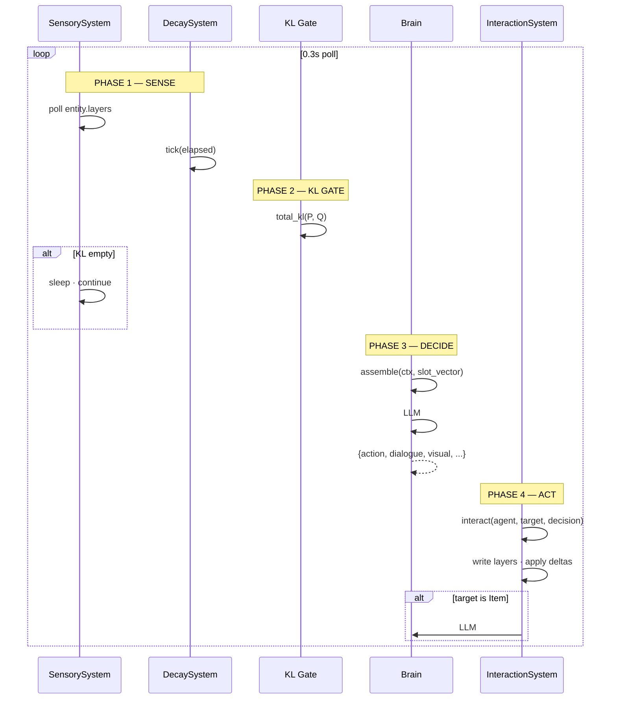
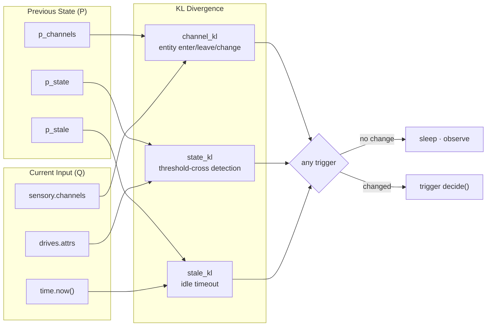
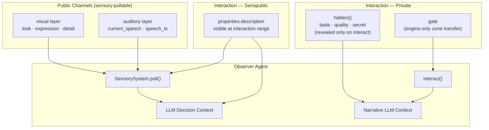
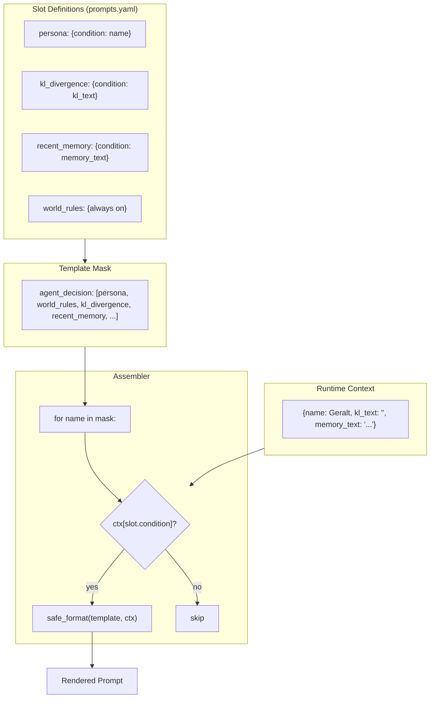
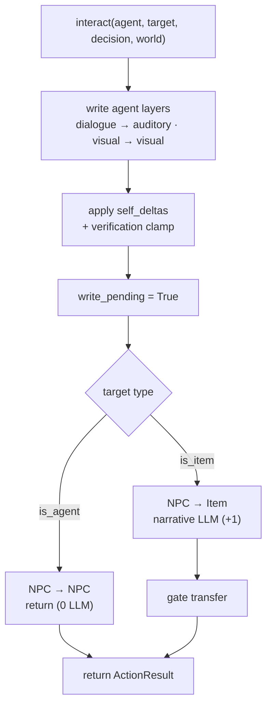

<p align="center">
  
  
  
  
  
</p>

<h1 align="center">
  AgentWorld Async
</h1>

<p align="center">
  <b>P/Q/KL-Driven · Layer-Architected · 4-Phase Pipeline · Slot-Vector Prompting</b>
</p>

<p align="center">
  <i>The world doesn't change — the agent doesn't think.<br/>
  世界不动，Agent 不动。</i>
</p>

---

# 中文版

## 是什么

一个 **纯 Python 异步多智能体自主世界引擎**。8 个 LLM 驱动的 Agent 在 3 个区域、28 个实体的世界中自主生活、社交、工作。全部行为由 YAML 配置驱动，Python 代码零领域知识硬编码。

---

## 为什么不同

### 核心洞察：世界不动，Agent 不动

斯坦福 2023 年《Generative Agents》按固定时间间隔反思→规划→行动，每交互要 3+ 次 LLM 调用。我们有一个反直觉的发现：**Agent 不需要定时思考。它只需要在"世界与预期不符"时才动。**

实现方式：P/Q/KL 注意力门控。Agent 维护内部预期 P（上次快照的世界状态），每 0.3s 对比 Q（当前感官输入）。P=Q 时零 LLM 调用。P≠Q 时触发决策。四通道（听觉/视觉/状态/时差）并行 diff，任一通道变化即触发。

### 实证数据

**180 秒运行测试（8 个 Agent，DeepSeek-chat）：**

| 指标 | 数值 | 说明 |
|------|------|------|
| 总行动数 | **318** | 平均每秒 1.77 次行动 |
| NPC 互相对话 | **204 (64%)** | Agent 之间的直接社交互动 |
| 对话响应率 | **198/204 (97%)** | 几乎每句话都有回应 |
| 邻接重复率 | **14.2%** | 无外部去重滤波器，LLM 靠记忆自主避免 |
| 四模态覆盖 | 对话 53% · 故事 54% · 表情 79% · 内心 79% | 每个 Agent 产出丰富的多模态输出 |
| 属性自我调节 | social 136次 · fun 122次 · thirst 40次 | Agent 自主管理自身状态 |

**社交网络密度**（top-5 对话对）：

| 对话对 | 次数 | 场景 |
|--------|------|------|
| 叶奈法 ↔ 凯拉 | 28+26 | 草药小屋炼金协作 |
| 特莉丝 → 杰洛特 | 14 | 酒馆社交 |
| 维瑟米尔 → 丹德里恩 | 11 | 酒馆故事讲述 |
| 卓尔坦 → 丹德里恩 | 11 | 酒馆喝酒聊天 |

**8 个 Agent 形成了两个清晰的社交聚集**：酒馆群体（杰洛特/维瑟米尔/卓尔坦/丹德里恩/特莉丝/兰伯特）围绕喝麦酒、掰手腕、讲故事；草药小屋群体（叶奈法/凯拉）围绕炼金术协作。

### 与同类工作的量化对比

| | Generative Agents<br/>Park et al. 2023 | CrewAI / AutoGen | **AgentWorld Async** |
|---|---|---|---|
| 每次 NPC 交互 LLM 调用 | **3+**（plan + reflect + act） | 1 per tool call | **1** |
| 发呆时的 LLM 调用 | 有（定时反思） | 无（被动等待） | **0**（KL 门控） |
| Agent 间通信 | 单向观察 | 消息传递 | **相互观察** — 写层→轮询 |
| 配置方式 | Code + JSON | Python 装饰器 | **纯 YAML** — 换世界零代码 |
| 记忆方式 | 反思摘要 | 对话历史 | **全量决策 JSON** |
| 动作定义 | 自然语言计划 | 工具函数注册 | **自然语言** — 无动作注册表 |
| 架构规模 | 25 agent, 2天 | 不等 | **8 agent, 33源文件, ~1900行 Python** |

---

## 架构



### 4 相位流水线



### P/Q/KL 注意力门控



### 三层可见性模型



### Slot 向量系统



### `interact()` 统一入口



---

## 核心创新

| # | 创新点 | 与同类工作的区别 |
|---|--------|----------------|
| 1 | **P/Q/KL 注意力门控** | 只有世界变化时才调 LLM。发呆时 0 调用。Generative Agents 每 N 秒无条件反思。 |
| 2 | **4 相位流水线** | SENSE → KL GATE → DECIDE → ACT。每相可独立跳过。无状态机锁死 Agent。 |
| 3 | **Slot 向量系统** | 所有 slot 集中定义。模板=名字列表。condition=ctx key。新增 slot 只需 YAML，零代码。 |
| 4 | **层架构** | 视觉/听觉/交互层。`observe(d)` 是唯一接口。轮询是泛型的。新模态=YAML一行。 |
| 5 | **三层可见性** | 公开（视觉/听觉）→ 半公开（交互描述）→ 私密（hidden/gate）。 |
| 6 | **自然语言动作** | 无动作注册表。LLM 描述想做什么，引擎匹配目标。Agent 可以尝试任何事。 |
| 7 | **记忆驱动自调节** | 全量决策 JSON 存入记忆。LLM 看到自己的历史，自主避免重复。无需外部去重滤波器。 |
| 8 | **配置即行为** | 所有文本、阈值、货币键、属性名来自 YAML。Python 是纯引擎。换 YAML=换世界。 |

---

## 设计哲学

> **Agent 只做一件事：观察世界，并在世界与预期不符时行动。**
> 所有不在这个闭环里的机制都是多余的。

我们在 v1→v6 的进化中持续删除机制，从不添加：
- v3: 删除 graph resolver chain
- v4: 删除 event_bus, submit() 链
- v5: 删除动作注册表 (actions dict)
- v5.1: Agent 状态从 Entity 归位到 AgentLayer
- v5.2: 删除 fuzzy_match_action, 硬编码 KL 文本
- **v6: 删除去重滤波器 (duplication.py), 观察状态机 (check_observing), 364 行死代码**

方向永远是删除，不是添加。

---

## 项目结构

```
AgentWorld_Async/                  # 33 源文件 · ~1900 行 Python · ~810 行 YAML
├── config/
│   ├── world.yaml                 # 3 区域 · 28 实体 · 模拟参数
│   ├── prompts.yaml               # 系统提示 · 模板 · slots · 标签
│   └── llm.yaml                   # 提供商 · 模型 · API Key
├── src/
│   ├── layers/                    # 层定义 (5 文件)
│   ├── entity/                    # 实体模型 (1 文件)
│   ├── systems/                   # 跨层编排 (3 文件)
│   ├── agent/                     # Agent 心智 (5 文件)
│   ├── core/                      # 引擎核心 (6 文件)
│   ├── llm/                       # LLM 客户端 (1 文件)
│   ├── prompt/                    # Prompt 组装 (2 文件)
│   └── loop.py                    # 4 相位流水线
├── main.py                        # CLI 入口
└── README.md
```

---

## 快速开始

```bash
pip install -r requirements.txt
# 编辑 config/llm.yaml 填入 API Key
python main.py                              # 8-agent 并发测试 (默认 60s)
python main.py --runtime 180 --validate     # 3min + 属性校验
python main.py --demo                       # 单 Agent 演示
python main.py --persist world.db           # SQLite 持久化
python main.py --output trace.json          # 保存追踪数据
```

## 更新记录

| 版本 | 里程碑 |
|------|--------|
| **v6** | Slot 向量系统 (condition=ctx key)。删除去重滤波器和观察状态机——记忆驱动自调节 + KL门是等待机制。4相位流水线。死代码清理 -364行 -3文件。 |
| v5.2 | 删除动作字典。交互层 hidden + gate。KL 文本注入（零硬编码）。 |
| v5 | 泛型 Layer.observe()。属性校验。SQLite 持久化。 |
| v4 | P/Q/KL 门控 + 观察基线 + 写锁。统一 interact()。 |

---

## 许可证

MIT

---

# English

## What It Is

A **pure-Python asynchronous multi-agent autonomous world engine**. Eight LLM-driven agents live, socialize, and work across 3 zones with 28 entities. All behavior is driven by YAML configuration; Python contains zero hardcoded domain knowledge.

---

## Why It's Different

### Core Insight: No Change, No Thought

Stanford's 2023 *Generative Agents* reflects on a fixed interval (plan → reflect → act), requiring 3+ LLM calls per interaction. We found a counterintuitive insight: **an agent doesn't need to think on a schedule. It only needs to act when the world diverges from its expectations.**

Implementation: **P/Q/KL Attention Gate**. The agent maintains an internal prediction P (last snapshot of the world) and compares it to Q (current sensory input) every 0.3s. When P=Q: **zero LLM calls**. When P≠Q: the agent decides. Four channels (auditory/visual/state/temporal) diff in parallel; any channel changing triggers action.

### Empirical Results

**180-second run (8 agents, DeepSeek-chat):**

| Metric | Value | Notes |
|--------|-------|-------|
| Total Actions | **318** | 1.77 actions/sec |
| NPC↔NPC Interactions | **204 (64%)** | Direct social engagement between agents |
| Response Rate | **198/204 (97%)** | Nearly every utterance gets a reply |
| Adjacent Repeat Rate | **14.2%** | No external dedup filter; LLM self-regulates via memory |
| Modality Coverage | Dialogue 53% · Story 54% · Visual 79% · Internal 79% | Rich multimodal output from every agent |
| Self-Delta Management | social 136× · fun 122× · thirst 40× | Agents autonomously manage their own state |

**Social Network Density** (top-5 conversational pairs):

| Pair | Count | Context |
|------|-------|---------|
| Yennefer ↔ Keira | 28+26 | Herb hut alchemy collaboration |
| Triss → Geralt | 14 | Tavern socializing |
| Vesemir → Dandelion | 11 | Tavern storytelling |
| Zoltan → Dandelion | 11 | Tavern drinking & chatting |

**Two distinct social clusters emerged naturally**: the tavern group (Geralt/Vesemir/Zoltan/Dandelion/Triss/Lambert) centered on ale, arm-wrestling, and stories; the herb hut pair (Yennefer/Keira) collaborating on alchemy.

### Quantitative Comparison

| | Generative Agents<br/>Park et al. 2023 | CrewAI / AutoGen | **AgentWorld Async** |
|---|---|---|---|
| LLM calls / NPC interaction | **3+** (plan + reflect + act) | 1 per tool call | **1** |
| LLM calls while idle | Yes (scheduled reflection) | No (passive) | **0** (KL gate) |
| Agent communication | One-way observation | Message-passing | **Mutual observation** — write layer → poll |
| Configuration | Code + JSON | Python decorators | **Pure YAML** — swap world, zero code |
| Memory | Reflection summary | Chat history | **Full decision JSON** |
| Action definition | NL plans | Tool function registry | **Natural language** — no action registry |
| Codebase | 25 agents, 2-day sim | Varies | **8 agents, 33 files, ~1900 lines** |

---

## Architecture

*Same Mermaid diagrams as Chinese section above.*

---

## Key Innovations

| # | Innovation | Comparison to Prior Work |
|---|-----------|------------------------|
| 1 | **P/Q/KL Attention Gate** | Only calls LLM when world changes. 0 calls while idle. Generative Agents reflects unconditionally every N seconds. |
| 2 | **4-Phase Pipeline** | SENSE → KL GATE → DECIDE → ACT. Each phase independently skipable. No state machine locks the agent. |
| 3 | **Slot Vector System** | All slots in one registry. Template = name list. condition = ctx key. New slot = YAML only, zero code. |
| 4 | **Layer Architecture** | Visual/Auditory/Interaction layers. `observe(d)` is the sole interface. Polls are generic. New modal = one YAML line. |
| 5 | **Three Visibility Scopes** | Public (visual/auditory) → Semipublic (interaction description) → Private (hidden/gate). |
| 6 | **Natural Language Actions** | No action registry. LLM describes intent; engine matches to entities. Agents can try anything. |
| 7 | **Memory-Driven Self-Regulation** | Full decision JSON in memory. LLM sees its own history, avoids repetition autonomously. No external dedup filter needed. |
| 8 | **Config-as-Behavior** | All text, thresholds, currency keys from YAML. Python is a pure engine. Swap YAML = new world. |

---

## Design Philosophy

> **The agent does one thing: observes the world, and acts when the world diverges from expectation.**
> Any mechanism outside this loop is extraneous.

We have continuously *removed* mechanisms across v1→v6:
- v3: Removed graph resolver chain
- v4: Removed event_bus, submit() chain
- v5: Removed action registry (actions dict)
- v5.1: Moved agent state from Entity to AgentLayer
- v5.2: Removed fuzzy_match_action, hardcoded KL text
- **v6: Removed dedup filter (duplication.py), observing state machine (check_observing), 364 lines of dead code**

The direction is always removal, never addition.

---

## Project Structure

```
AgentWorld_Async/                  # 33 source files · ~1900 lines Python · ~810 lines YAML
├── config/
│   ├── world.yaml                 # 3 zones · 28 entities · simulation params
│   ├── prompts.yaml               # system prompts · templates · slots · labels
│   └── llm.yaml                   # provider · model · API key
├── src/
│   ├── layers/                    # Layer definitions (5 files)
│   ├── entity/                    # Entity model (1 file)
│   ├── systems/                   # Cross-layer orchestration (3 files)
│   ├── agent/                     # Agent mind (5 files)
│   ├── core/                      # Engine core (6 files)
│   ├── llm/                       # LLM client (1 file)
│   ├── prompt/                    # Prompt assembly (2 files)
│   └── loop.py                    # 4-phase pipeline
├── main.py                        # CLI entry
└── README.md
```

---

## Quick Start

```bash
pip install -r requirements.txt
# Edit config/llm.yaml with your API key
python main.py                              # 8-agent concurrent test (default 60s)
python main.py --runtime 180 --validate     # 3min + attribute validation
python main.py --demo                       # Single-agent demo
python main.py --persist world.db           # SQLite persistence
python main.py --output trace.json          # Save trace data
```

## Update Log

| Version | Milestone |
|---------|-----------|
| **v6** | Slot vector system (condition=ctx key). Removed dedup filter + observing state machine — memory-driven self-regulation + KL gate as wait mechanism. 4-phase pipeline. Dead code elimination: -364 lines, -3 files. |
| v5.2 | Action dict eliminated. Interaction layer hidden + gate. KL text injection (zero hardcode). |
| v5 | Generic Layer.observe(). Property verification. SQLite persistence. |
| v4 | P/Q/KL gate + observing baseline + write-pending lock. Unified interact(). |

---

## License

MIT
