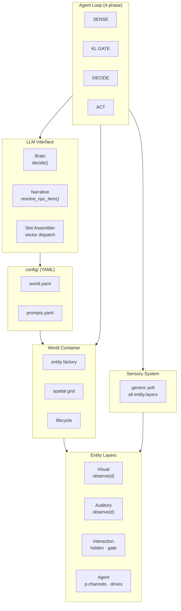
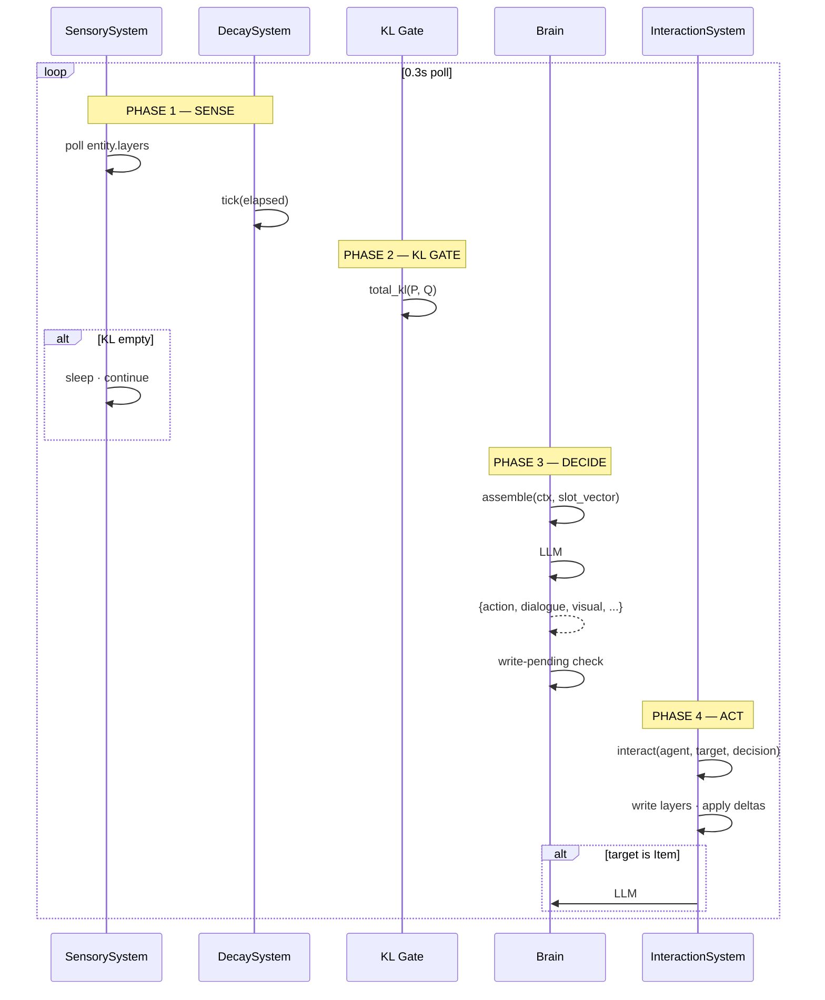
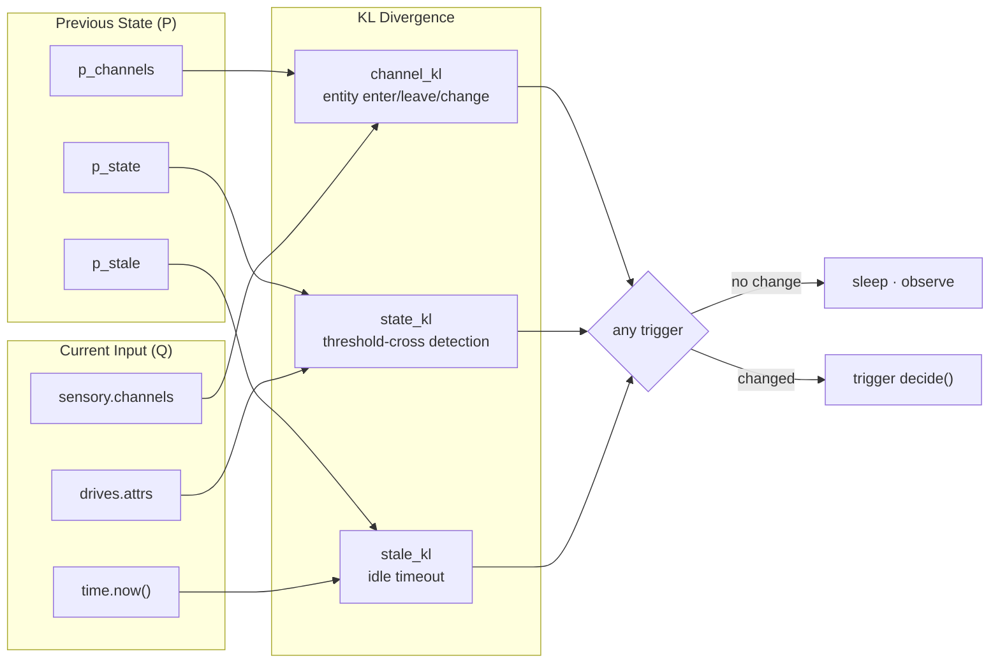
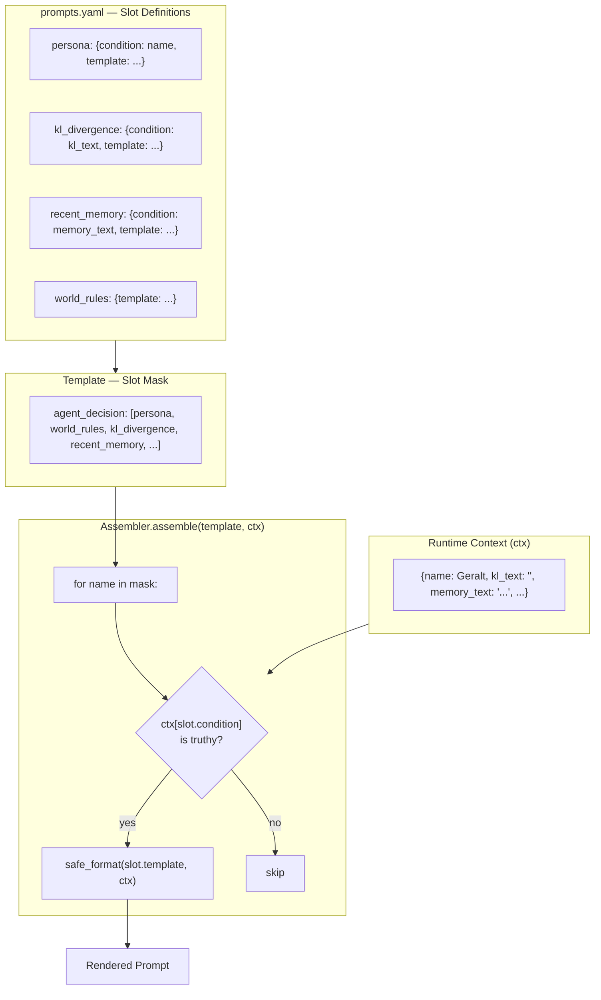
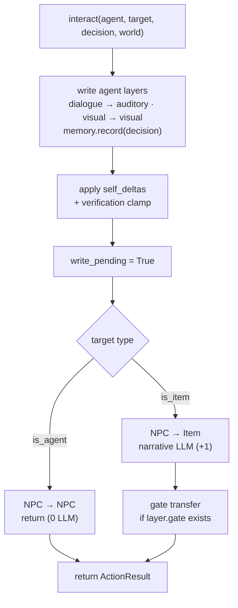

<p align="center">
  
  
  
  
  
</p>

<h1 align="center">
  AgentWorld Async
</h1>

<p align="center">
  <b>P/Q/KL-Driven · Layer-Architected · Slot-Vector Prompting · 4-Phase Pipeline</b>
</p>

<p align="center">
  <i>The world doesn't change — the agent doesn't think.</i>
</p>

---

## System Architecture



---

## Agent Loop — 4-Phase Pipeline



---

## P/Q/KL Attention Gate



---

## Layer Model — Three Channels


---

## Slot Vector System



---

## `interact()` — Unified Entry



---

## Comparison

| | Generative Agents<br/><sub>Park et al. 2023</sub> | CrewAI / AutoGen | **AgentWorld Async** |
|---|---|---|---|
| **Decision trigger** | Fixed-interval reflection | Tool-calling pipeline | **P/Q/KL gate** — event-driven |
| **LLM calls / interaction** | 3+ (plan + reflect + act) | 1 per tool call | **1** (NPC→NPC) · **2** (NPC→Item) |
| **Communication** | One-way observation | Message-passing | **Mutual observation** — write to layer, others poll |
| **Personality** | Prompt only | Prompt only | **Self-determined** — LLM output drives behavior |
| **Config** | Code + JSON | Python decorators | **Pure YAML** — zero code to switch worlds |
| **Memory** | Reflection summary | Chat history | **Full decision JSON** — all modalities |
| **Architecture** | Monolithic loop | Distributed agents | **Layer-based** — Entity/Layer clean separation |
| **Slot system** | Hardcoded | N/A | **Vector dispatch** — condition = ctx key |

---

## Key Innovations

| # | Innovation | Description |
|---|-----------|-------------|
| 1 | **P/Q/KL Attention Gate** | 4-channel parallel diff. Agent only calls LLM when world changes. No timers. |
| 2 | **4-Phase Pipeline** | SENSE → KL GATE → DECIDE → ACT. Each phase independently skipable. |
| 3 | **Slot Vector System** | All slots in one registry. Template = name list. `condition` = ctx key. Zero code to add a slot. |
| 4 | **Layer Architecture** | Visual/Auditory/Interaction layers. `observe(d)` is the sole interface. Polls are generic. |
| 5 | **Three Visibility Scopes** | Public (visual/auditory) → Semi-public (interaction description) → Private (hidden/gate). |
| 6 | **Natural Language Actions** | No action registry. LLM describes what it wants. Engine matches to entities. |
| 7 | **Memory-Driven Self-Regulation** | Full decision JSON in memory. LLM sees its own history, avoids repetition autonomously. |
| 8 | **Config-as-Behavior** | All text, thresholds, currencies from YAML. Zero hardcoded domain knowledge. |
| 9 | **AgentLayer Isolation** | All agent state (KL, drives, memory) on AgentLayer. Entity is pure container. |
| 10 | **Typed LoopConfig** | Dataclass replaces raw dict — type-safe, IDE-completable. |

---

## Project Structure

```
AgentWorld_Async/                  # 33 source files · ~1900 lines
├── config/
│   ├── world.yaml                 # 3 zones, 28 entities, simulation params
│   ├── prompts.yaml               # system_prompts, templates, slots, labels
│   └── llm.yaml                   # provider (OpenAI/DeepSeek/MiniMax), model
├── src/
│   ├── layers/                    # Layer definitions (5 files)
│   │   ├── base.py                #   Layer base: observable_radius, observe(d)
│   │   ├── visual.py              #   VisualLayer: visible_radius, sprite
│   │   ├── auditory.py            #   AuditoryLayer: audible_radius, speech
│   │   ├── interaction.py         #   InteractionLayer: hidden, gate, apply_deltas
│   │   └── agent.py               #   AgentLayer: p_channels, drives, write-pending
│   ├── entity/                    # Entity model (1 file)
│   │   └── entity.py              #   Entity: id, name, zone, pos, layers{}
│   ├── systems/                   # Cross-layer orchestration (3 files)
│   │   ├── sensory.py             #   Generic layer poll → sensory.channels
│   │   ├── interaction.py         #   interact() + find_entity_at + resolve_npc
│   │   └── decay.py               #   DriveSystem.tick(elapsed)
│   ├── agent/                     # Agent mind (5 files)
│   │   ├── brain.py               #   decide() + extract_json()
│   │   ├── drives.py              #   DriveSystem: attrs, decay, prompt table
│   │   ├── memory.py              #   AgentMemory: ring buffer, to_prompt_text
│   │   ├── sensory_memory.py      #   SensoryMemory: channels[ch][eid] → SensorRecord
│   │   └── inbox.py               #   Inbox: send / drain / to_prompt_text
│   ├── core/                      # Engine core (6 files)
│   │   ├── world.py               #   World container, entity factory, spatial grid
│   │   ├── kl_divergence.py       #   4-channel P/Q KL diff, state threshold
│   │   ├── verification.py        #   @register chain, attribute bounds check
│   │   ├── persistence.py         #   SQLite WorldDB (runs, snapshots, interactions)
│   │   ├── lifecycle.py           #   EntityLifecycle: spawn, transfer_zone
│   │   ├── spatial_grid.py        #   O(k) cell-based proximity queries
│   │   └── clock.py               #   Simulated clock, configurable timescale
│   ├── llm/                       # LLM client (1 file)
│   │   └── client.py              #   OpenAI/DeepSeek/MiniMax, retry, response_format
│   ├── prompt/                    # Prompt assembly (2 files)
│   │   ├── assembler.py           #   Slot vector dispatch + safe_format
│   │   └── loader.py              #   YAML config reader
│   └── loop.py                    #   4-phase pipeline + LoopConfig dataclass
├── main.py                        # CLI: --test, --demo, --persist, --validate
└── README.md
```

---

## Quick Start

```bash
pip install -r requirements.txt
# Edit config/llm.yaml with your API key
python main.py                              # 8-agent concurrent test (default 60s)
python main.py --runtime 180 --validate     # 3min + attribute validation
python main.py --demo                       # Single-agent demo
python main.py --persist world.db           # Enable SQLite persistence
python main.py --output trace.json          # Save trace data
```

---

## Update Log

| Version | Milestone |
|---------|-----------|
| **v6** | Slot vector system — condition = ctx key, zero-code slot addition. Duplication filter deleted (memory-driven self-regulation). Observing state machine deleted (KL gate is the wait mechanism). 4-phase pipeline (SENSE→KL→DECIDE→ACT). Dead code elimination: -364 lines, -3 files. Three visibility scopes for interaction layer. |
| v5.2 | Action dict eliminated. Hidden properties + gate on InteractionLayer. KL text injection. |
| v5 | Generic Layer.observe(). Sensory polls all layers. Property verification. SQLite persistence. |
| v4 | P/Q/KL gate + observing baseline + write-pending lock. Unified interact(). |
| v3 | Story-first pipeline + per-agent projection + verify |
| v2 | Multi-agent async: inbox messaging, hybrid busy-queue |
| v1 | Single-agent demo with graph-based world model |

---

## License

MIT
