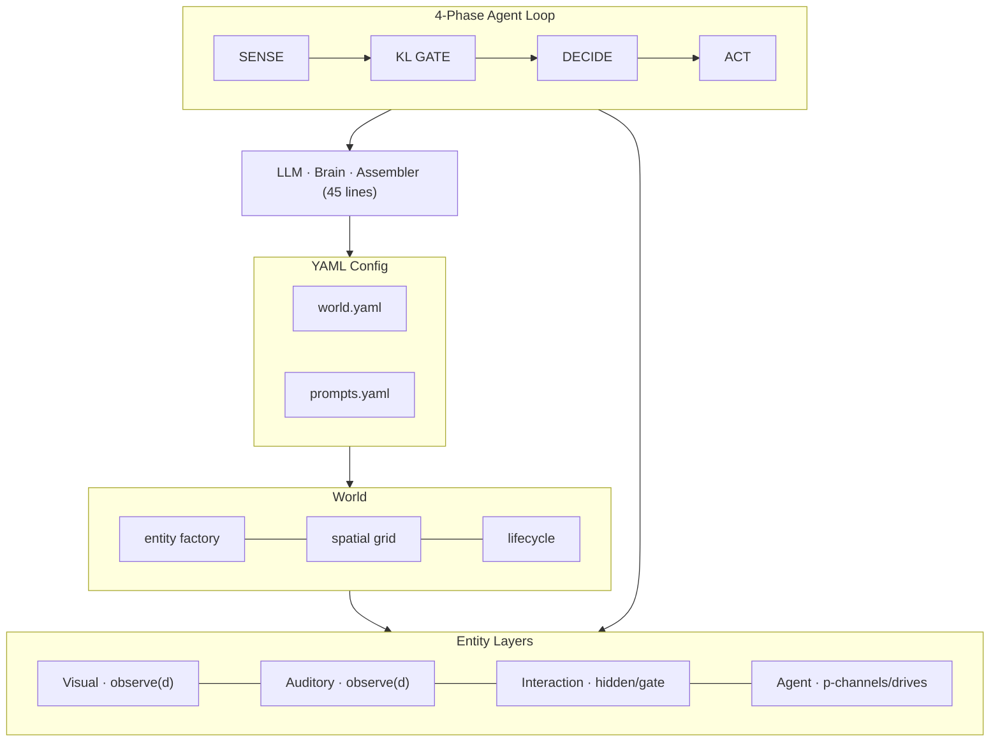
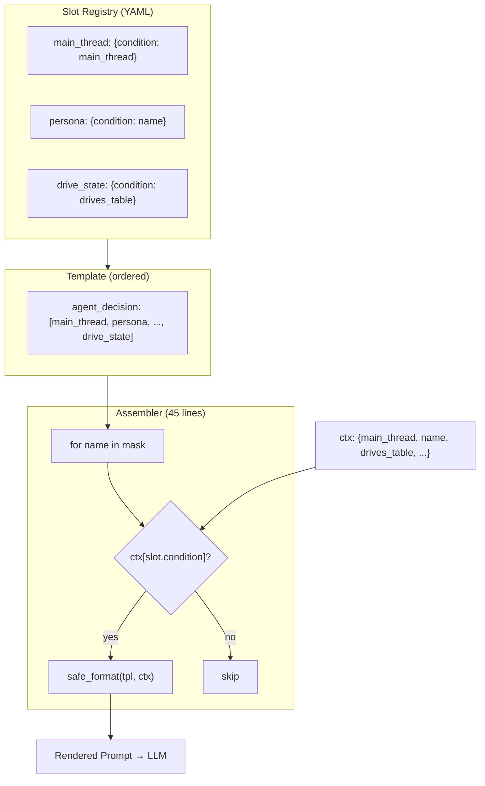

<p align="center">
  
  
  
  
  
</p>

<h1 align="center">AgentWorld Async</h1>

<p align="center">
  <b>Between perception and action, code does one thing: compare world model to sensory input.<br/>
  Everything else — what matters, what to do, what not to repeat — is declaration, not code.</b>
</p>

<p align="center">
  <i>The world doesn't change — the agent doesn't think.</i>
</p>

---

# 中文版

## 概述

纯 Python 异步多智能体自主世界引擎。25 个 LLM 驱动 Agent 在 3 个 Zone 间自主社交、穿越、协作。全部行为 YAML 配置驱动，Python **零认知代码**。33 源文件，~1800 行 Python，~820 行 YAML。

### 核心主旨

> **引擎提供世界，LLM 提供认知。**
>
> 引擎不替 LLM 做判断。引擎说"mood=5"——不说"你心情很差"。
> 引擎说"这里有路牌"——不说"你应该穿越到另一个区域"。
> 所有认知判断通过 **声明式 YAML slot** 引导 LLM 自主完成。
>
> 📄 完整哲学：[DESIGN_PHILOSOPHY.md](DESIGN_PHILOSOPHY.md) · [META_PHILOSOPHY.md](META_PHILOSOPHY.md) · [PAPER.md](PAPER.md)

---

## 贡献

### 1. Slot Vector Architecture — 0 行认知代码

Generative Agents (Park et al., 2023) 的认知栈约 730 行 Python。AgentWorld 用 **12 个声明式 YAML slot** 替代全部认知流程。45 行的 Assembler 遍历模板的 slot 列表，按 condition 激活，按顺序决定优先级。新增认知能力 = YAML 两行，Python 零改动。

### 2. P/Q/KL Attention Gate — 预测误差驱动

Agent 维护内部世界模型 P，每 0.3s 对比感官输入 Q。P=Q → 0 次 LLM 调用。P≠Q → 触发决策。四通道（听觉/视觉/状态/时差）并行 diff。**世界不变，Agent 不动。**

### 3. Per-Attribute Drive System — 声明式属性引擎

每个属性独立定义 `{min, max, decay, description}`。引擎只渲染裸数据 + 描述：

```
| 属性 | 数值 | 描述 |
|------|------|------|
| mood | 5/100 | 0=绝望可能轻生或自毁。100=极度愉悦。 |
| thirst | 65/100 | 100=喉咙冒烟急需饮水。0=完全不渴。 |
| eddies | 150 | 赛博朋克世界。无自然衰减。 |    ← 换世界换属性
```

无紧急标签，无引擎判断。LLM 自己读描述决定行动。属性名、范围、衰减率、描述全部来自 YAML。

### 4. Three-Channel Sensory — 模板驱动感知

视觉（远观+细节）· 听觉（谁说了什么）· 可交互（description + 可穿越标记）。三通道渲染模板全在 YAML。Gate 实体出现在"可交互"通道，标注 `【可穿越 → village】`。Agent 自主决定穿越。

### 5. 删除胜过添加

v1→v8 持续删除"代码替 LLM 做判断"的机制：graph resolver → submit chain → event bus → action registry → observing state machine → duplication filter → sensory hardcode → inbox → urgency labels。每删除一个调度器，LLM 多拿回一块决策权。

---

## 实证

**180s 测试（25 Agent, 3 Zone, DeepSeek-chat）:**

| 指标 | 数值 |
|------|------|
| 总行动 | **552** |
| NPC↔NPC 交互 | **443 (80%)** |
| 邻接重复率 | **2.8%**（无外部去重） |
| KL change 触发 | **539** (97.7%) |
| Stale 触发 | **5** (0.9%) |
| 主线自设定 | **24/25** (96%) |
| 对话覆盖率 | **64%** |
| Zone 穿越 | **2 次 / 30s**（Gate 交互） |
| 认知代码 (Python) | **0 行** |

### Drive 渲染（实际 LLM prompt）

```
| 属性 | 数值 | 描述 |
|------|------|------|
| thirst | 55/100 | 100=喉咙冒烟急需饮水。0=完全不渴。 |
| hunger | 45/100 | 100=体力不支需要进食。0=完全不饿。 |
| social | 25/100 | 100=极度渴望与人交流。0=只想独处。 |
| energy | 80/100 | 0=精疲力竭需休息。100=精力充沛。 |
| fun    | 45/100 | 100=极度无聊需找乐子。0=已尽兴。 |
| mood   | 60/100 | 0=绝望可能轻生或自毁。100=极度愉悦。 |
参考描述栏理解每个数值的含义。
```

### 对比

| | Generative Agents | CrewAI | **AgentWorld Async** |
|---|---|---|---|
| LLM 调用 / NPC 交互 | 3+ | 1 per tool | **1** |
| 发呆 LLM 调用 | 有 | 无 | **0**（KL gate） |
| 认知代码 | ~730 行 Python | N/A | **0 行**（12 YAML slot） |
| 动作定义 | NL 计划 | 工具函数 | **自然语言**，无注册表 |
| 记忆 | 反思摘要 | 对话历史 | **自然语言 story** |
| 属性系统 | 无 | 无 | **声明式 per-attr** |
| Config | Code + JSON | Python decorator | **纯 YAML** |
| 规模 | 25 agent, 2天 | 不等 | **25 agent, 33 文件, ~1800 行** |

---

## 架构



### Slot 向量：认知 = 组合



---

## 项目结构

```
AgentWorld_Async/               # 33 files · ~1800 lines Python · ~820 lines YAML
├── config/
│   ├── world.yaml              # 3 zones, 67 entities, per-attr drive config
│   ├── prompts.yaml            # system prompts, 12 slots, sensory_prompts
│   └── llm.yaml                # provider (DeepSeek/OpenAI/MiniMax)
├── src/
│   ├── layers/                 # Layer definitions (5 files)
│   ├── entity/                 # Entity model (1 file)
│   ├── systems/                # Sensory, Interaction, Decay (3 files)
│   ├── agent/                  # Brain, Memory, Drives, SensoryMemory (4 files)
│   ├── core/                   # World, KL, Verification, Persistence, Lifecycle, SpatialGrid, Clock (7 files)
│   ├── llm/                    # LLM client (1 file)
│   ├── prompt/                 # Assembler, Loader (2 files)
│   └── loop.py                 # 4-phase pipeline + LoopConfig
├── main.py                     # CLI entry
├── DESIGN_PHILOSOPHY.md        # AgentWorld-specific philosophy
├── META_PHILOSOPHY.md          # Cross-domain meta principles
├── PAPER.md                    # ICLR/NeurIPS draft
└── README.md
```

---

## 快速开始

```bash
pip install -r requirements.txt
# Edit config/llm.yaml with API key
python main.py                              # 25-agent test (default 60s)
python main.py --runtime 180 --validate     # 3min + validation
python main.py --demo                       # Single-agent demo
python main.py --output trace.json          # Save trace data
```

## 版本

| Ver | Milestone |
|-----|-----------|
| **v8** | Per-attr drive system (declarative {min,max,decay,description}). Gate crossing via interaction channel. Properties propagation fix. Drive injection bug fix. |
| v7.1 | `main_thread` slot. `idle_guidance` slot. Intent DONE prefix. Inbox deletion. |
| v7 | Three-channel sensory (visual·auditory·interaction). P/Q dict copy fix. |
| v6 | Slot vector system (condition=ctx key). Dedup + observing removal. |
| v5 | Generic Layer.observe(). Property verification. SQLite persistence. |
| v4 | P/Q/KL gate + write lock. Unified interact(). |

---

## License

MIT

---

# English

## Overview

A pure-Python asynchronous multi-agent autonomous world engine. Up to 25 LLM-driven agents socialize, travel, and collaborate across 3 zones. Fully YAML-configured; **zero cognitive code**. 33 files, ~1800 lines Python, ~820 lines YAML.

### Core Thesis

> **The engine provides the world. The LLM provides cognition.**
>
> The engine reports `mood=5` — not "you are depressed."
> The engine reports a gate exists — not "you should cross zones."
> All cognitive judgments are guided by declarative YAML slots.
>
> 📄 Full philosophy: [DESIGN_PHILOSOPHY.md](DESIGN_PHILOSOPHY.md) · [META_PHILOSOPHY.md](META_PHILOSOPHY.md) · [PAPER.md](PAPER.md)

---

## Contributions

1. **Slot Vector Architecture.** 12 YAML slots replace GA's ~730 lines of cognitive Python. 45-line Assembler: iterate template list, check condition, render template. New capability = YAML + one list entry. Zero Python changes.

2. **P/Q/KL Attention Gate.** Agent maintains internal world model P, compares to sensory input Q every 0.3s. P=Q → 0 LLM calls. P≠Q → agent decides. Four-channel parallel diff.

3. **Per-Attribute Drive System.** Each attribute declares `{min, max, decay, description}`. Engine renders raw data only:

```
| attr | value | description |
| mood | 5/100 | 0=self-destructive despair. 100=perfect contentment. |
| ram  | 12/100 | 0=system freeze. 100=full capacity. |
```

No urgency labels. No engine judgments. The LLM reads descriptions and decides. Attribute names, ranges, decay rates, and descriptions are all YAML-defined.

4. **Three-Channel Sensory.** Visual (look+detail) · Auditory (speech) · Interaction (description + transit markers). All rendered via YAML templates. Gate entities appear marked `【可穿越 → zone】`. Agents autonomously choose to cross zones.

5. **Removal Over Addition.** v1→v8 continuously removes mechanisms where code makes decisions for the LLM. Each deletion restores one degree of agent autonomy.

---

## Empirical Results

**180s test (25 agents, 3 zones, DeepSeek-chat):**

| Metric | Value |
|--------|-------|
| Total actions | **552** |
| NPC↔NPC rate | **80%** |
| Adjacent repetition | **2.8%** (no external dedup) |
| KL change triggers | **539** (97.7%) |
| Stale triggers | **5** (0.9%) |
| Main thread auto-set | **96%** |
| Dialogue coverage | **64%** |
| Zone crossings (30s) | **2** (gate interaction) |
| Cognitive code | **0 lines** |

## Comparison

| | Generative Agents | CrewAI | **AgentWorld Async** |
|---|---|---|---|
| LLM calls / NPC interaction | 3+ | 1 per tool | **1** |
| Idle LLM calls | Yes | No | **0** (KL gate) |
| Cognitive code | ~730 lines | N/A | **0 lines** (12 YAML slots) |
| Action definition | NL plans | Tools | **Natural language**, no registry |
| Memory | Summary | Chat history | **Natural language story** |
| Drive system | None | None | **Declarative per-attr** |
| Config | Code + JSON | Decorators | **Pure YAML** |
| Scale | 25 agents, 2 days | Varies | **25 agents, 33 files, ~1800 lines** |

---

*Architecture diagrams, Project Structure, Quick Start, and Version Log: same as Chinese section above.*

---

## License

MIT
